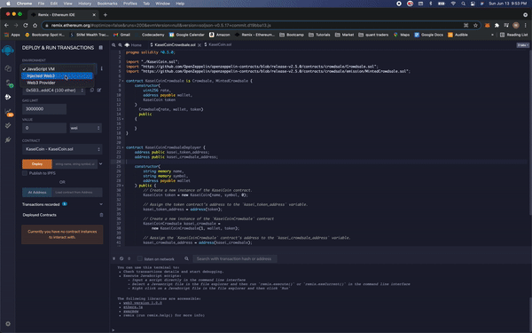
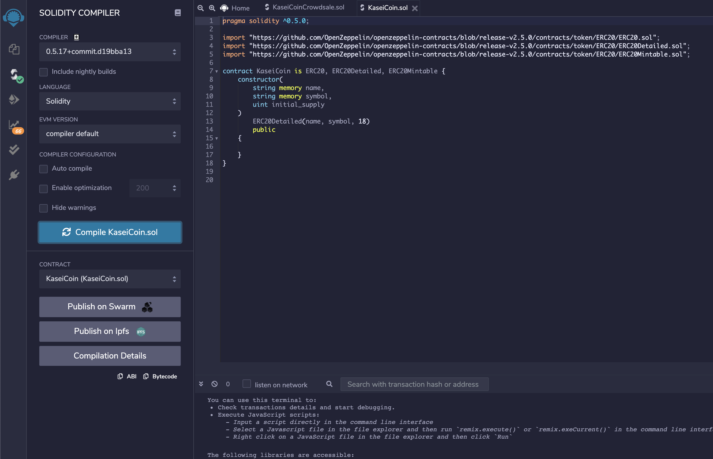
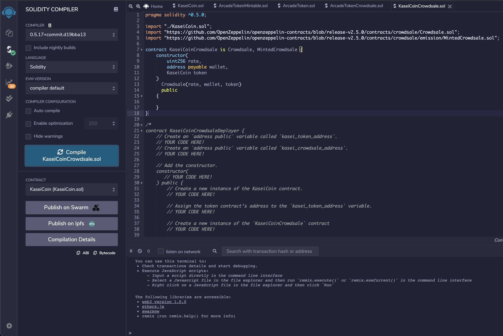
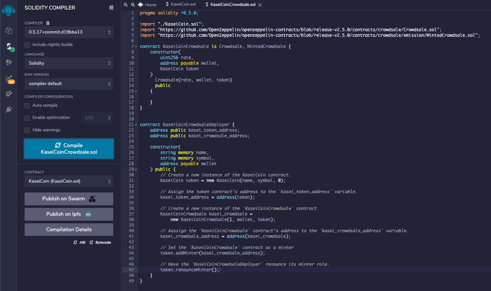

# Module 21 Challenge

This is the repository for my module 21 challenge. In this module challenge, we defined a new cryptocurrency called KaseiCoin.  

In this challenge I created a fungible token that is ERC-20 compliant and that is minted by using a Crowdsale contract from the OpenZeppelin Solidity library. 

The crowdsale contract that I created manages the entire crowdsale process, allowing users to send ether to the contract and in return receive KAI, or KaseiCoin tokens. My contract mints the tokens automatically and distributes them to buyers in one transaction.

#### This is for step 5 of the module challenge, where I record a video of a demo of the deployed contract in action. I use Remix, MetaMask, and Ganache for this step.



---

## Technologies

This is the smart contract code in the Solidity file:

```python
pragma solidity ^0.5.0;

import "./KaseiCoin.sol";
import "https://github.com/OpenZeppelin/openzeppelin-contracts/blob/release-v2.5.0/contracts/crowdsale/Crowdsale.sol";
import "https://github.com/OpenZeppelin/openzeppelin-contracts/blob/release-v2.5.0/contracts/crowdsale/emission/MintedCrowdsale.sol";

contract KaseiCoinCrowdsale is Crowdsale, MintedCrowdsale {
    constructor(
        uint256 rate,
        address payable wallet,
        KaseiCoin token
    )
      Crowdsale(rate, wallet, token)
      public
    {
    
    }
}


contract KaseiCoinCrowdsaleDeployer {
    address public kasei_token_address;
    address public kasei_crowdsale_address;

    constructor(
        string memory name,
        string memory symbol,
        address payable wallet
    ) public {
        // Create a new instance of the KaseiCoin contract.
        KaseiCoin token = new KaseiCoin(name, symbol, 0);
        
        // Assign the token contract’s address to the `kasei_token_address` variable.
        kasei_token_address = address(token);

        // Create a new instance of the `KaseiCoinCrowdsale` contract
        KaseiCoinCrowdsale kasei_crowdsale =
            new KaseiCoinCrowdsale(1, wallet, token);
            
        // Aassign the `KaseiCoinCrowdsale` contract’s address to the `kasei_crowdsale_address` variable.
        kasei_crowdsale_address = address(kasei_crowdsale);

        // Set the `KaseiCoinCrowdsale` contract as a minter
        token.addMinter(kasei_crowdsale_address);
        
        // Have the `KaseiCoinCrowdsaleDeployer` renounce its minter role.
        token.renounceMinter();
    }
}
```

---

## Examples


#### This image shows the KaseiCoin token contract after being compiled.



#### This image shows the KaseiCoin crowdsale contract after being compiled.




#### This image shows the KaseiCoin deployer contract after being compiled.




---

## Contributors

UCB Fintech Bootcamp, Wynham Guillemot 

---

## License

MIT License

Copyright (c) [2021] [UCB Fintech Bootcamp, Wyham Guillemot]

Permission is hereby granted, free of charge, to any person obtaining a copy
of this software and associated documentation files (the "Software"), to deal
in the Software without restriction, including without limitation the rights
to use, copy, modify, merge, publish, distribute, sublicense, and/or sell
copies of the Software, and to permit persons to whom the Software is
furnished to do so, subject to the following conditions:

The above copyright notice and this permission notice shall be included in all
copies or substantial portions of the Software.

THE SOFTWARE IS PROVIDED "AS IS", WITHOUT WARRANTY OF ANY KIND, EXPRESS OR
IMPLIED, INCLUDING BUT NOT LIMITED TO THE WARRANTIES OF MERCHANTABILITY,
FITNESS FOR A PARTICULAR PURPOSE AND NONINFRINGEMENT. IN NO EVENT SHALL THE
AUTHORS OR COPYRIGHT HOLDERS BE LIABLE FOR ANY CLAIM, DAMAGES OR OTHER
LIABILITY, WHETHER IN AN ACTION OF CONTRACT, TORT OR OTHERWISE, ARISING FROM,
OUT OF OR IN CONNECTION WITH THE SOFTWARE OR THE USE OR OTHER DEALINGS IN THE
SOFTWARE.
